# OASIS-INTERNSHIP

# Guess Number
About the Project
This is a classic Guess the Number game, developed as the first task for the Oasis Infobyte Java Development Internship. It's a standalone desktop application built with Java Swing, showcasing fundamental GUI programming concepts.

🎯 The objective is simple: guess the secret number between 1 and 100!

✨ Key Features:

🖥️ Java Swing GUI: A responsive and interactive desktop application.

🎲 Random Number Generation: A new challenge with every game (numbers 1-100).

💬 Instant Feedback: Guides you with "too high" or "too low" messages.

🔢 Guess Counter: Keeps track of your attempts.

✅ Input Validation: Handles invalid input gracefully.

🔄 Play Again Feature: Easily restart the game for more fun.

👨‍💻 Educational: Great for learning Java GUI, event handling, and basic game logic.

▶️ How to Play:

Launch the application.

Enter your guess in the input field.

Click "Submit" (or press Enter).

Follow the hints until you find the number!
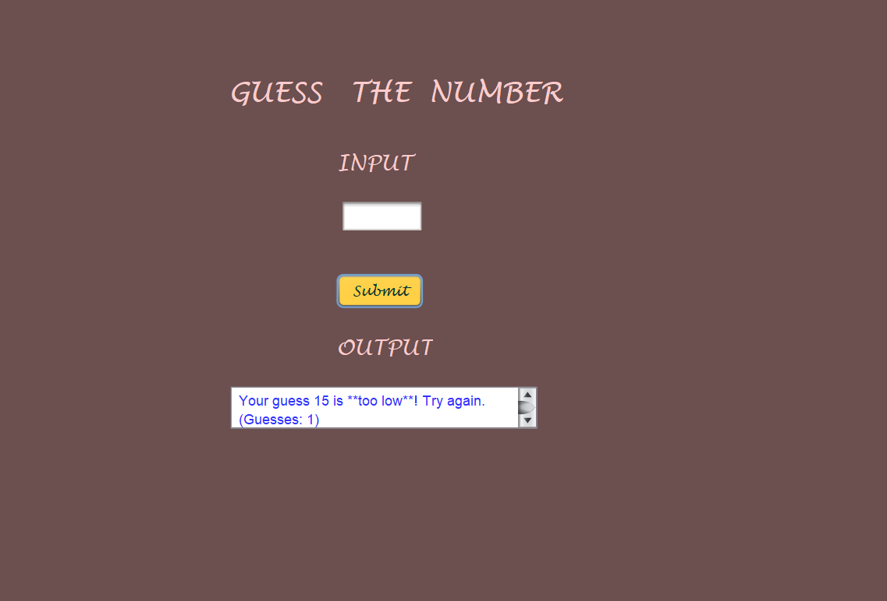

# Online Reservation System

## Project Overview
This Online Reservation System will include all the necessary fields which are required during online reservation system. This Online Reservation System will be easy to use and can be used by any person. The basic idea behind this project is to save data in a central database which can be accessed by any authorize person to get information and saves time and burden which are being faced by their customers.

## Key Features:
* **Simplified Booking:** Streamlined process for all your reservations.
* **Time-Saving:** Cut down on waiting and manual effort.
* **Reduced Burden:** Say goodbye to traditional booking hassles.
* **Secure & Easy-to-Use:** Intuitive and protected for peace of mind.
* **Anytime, Anywhere Access:** Your reservations, always at your fingertips.

### Main Screen
Here's the initial screen of the system outlining its benefits:

## Modules:

### 1. Login Form
To access this Online Reservation System, each user should have a valid login ID and password. After providing the correct login ID and password, users will be able to access the main system.

### 2. Register Form
Under reservation form users will have to fill the necessary details such as their basic details, train number, train name will automatically come in the box, class type, date of journey, from (place) to destination and after that, users will have to press insert button.

### 3. Cancellation Form
If passengers want to cancel their tickets then they have to provide their PNR number and after submitting it, this will display the entire information related to that particular PNR number. If users want to confirm their cancellation, in this case they have to press OK button.

## Database Schema
The project utilizes a `userinfo` table to store user credentials and travel preferences. Below is a snapshot of its structure and some sample data.

🏦 ## Bank Management System
This repository hosts a simple yet functional Bank Management System developed to demonstrate core banking operations and user management. It provides a foundational understanding of how bank accounts can be managed, transactions processed, and user data secured within a system.

✨ Features
Our Bank Management System encompasses the following key functionalities:

##Front Page - Bank Protocols & Security Rules
The initial screen outlining the bank's security measures and options to register or take a service.

##User Registration
Securely register new bank customers with essential personal and account details.

##Account Services
Users can perform various banking operations after logging in.
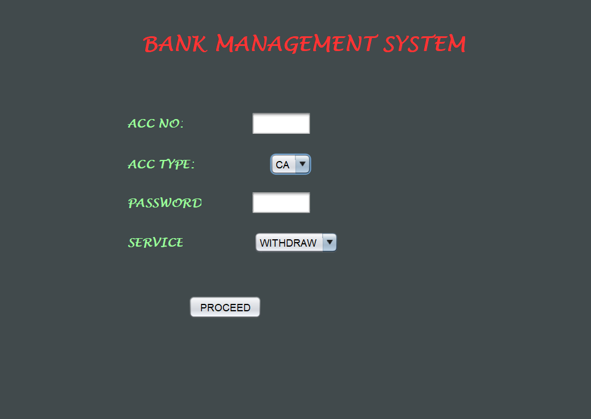

##Withdrawal
Facilitates cash withdrawals from existing accounts.
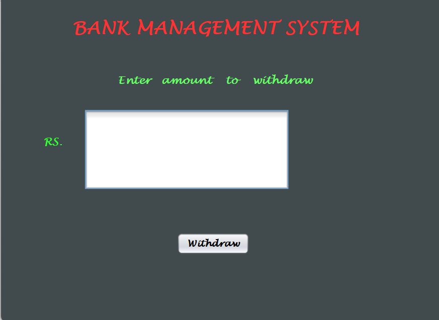

##Deposit
Allows users to deposit funds into their accounts.

##Transfer
Enables funds transfer between different bank accounts.
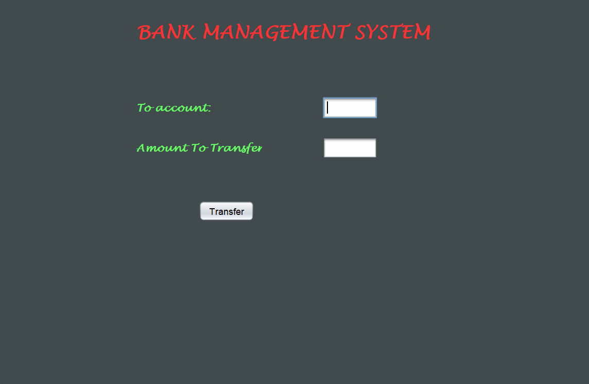

##Database View
A glimpse into the structured data storing customer and account information.
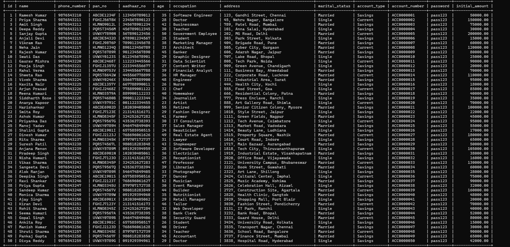

✍️##Online examination System

🚀 #Project Showcase
Our Java Swing-based online exam system provides a seamless and intuitive experience for both administrators and students. Here are a few key screens to illustrate its core functionality.

🖼️ #Screenshots
1.# Online Exam Login 🔒
The secure login screen ensures only authorized users can access the system. Students and administrators use their unique credentials to sign in.
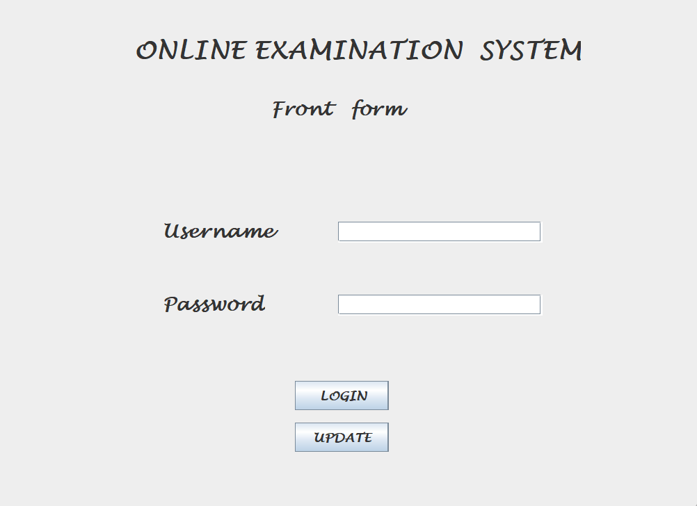

2.# Update Form ✍️
Administrators can easily manage questions and update the exam content through a dedicated form. This ensures the exam is always up-to-date and relevant.

3.# Exam Session ⏱️
This is the main interface for the student during the exam. The screen is designed to be clean and focused, displaying the question, options, and a timer to manage the session.

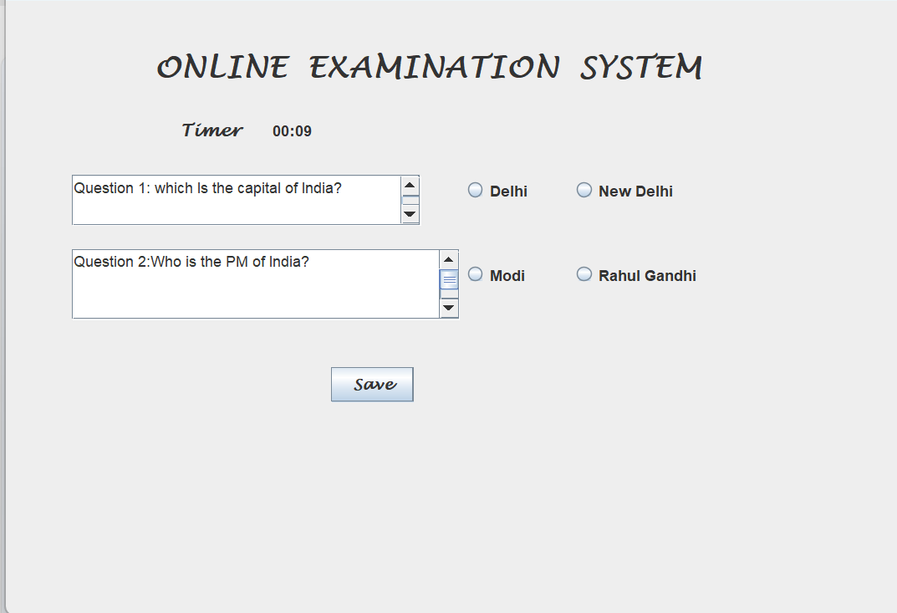

📚 Library Management System
This is a comprehensive library management system developed as part of the Oasis Infobyte internship. The system simplifies the process of managing library books, student information, and book issuance/return details.

✨ Features
Student Management: Add new students and manage their details.

Book Management: Add, edit, and manage book records.

Book Issuance: Keep track of issued books to students.

Book Returns: Record the return of books and calculate any late fees.

User-friendly Interface: Intuitive design for easy navigation.

🚀 Getting Started
To get a feel of the application, here is a step-by-step walkthrough of the key functionalities.

1. Login Page 🔑
The application starts with a secure login page. Users (librarians or administrators) must log in to access the system's functionalities.

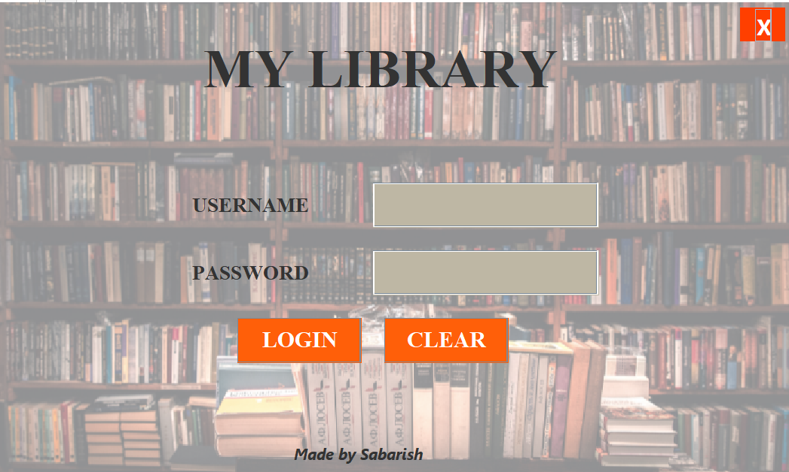

2. Home Dashboard 🏡
After a successful login, the user is redirected to the main dashboard. This page provides a quick overview of the library's status, including the number of available books, issued books, and registered students.

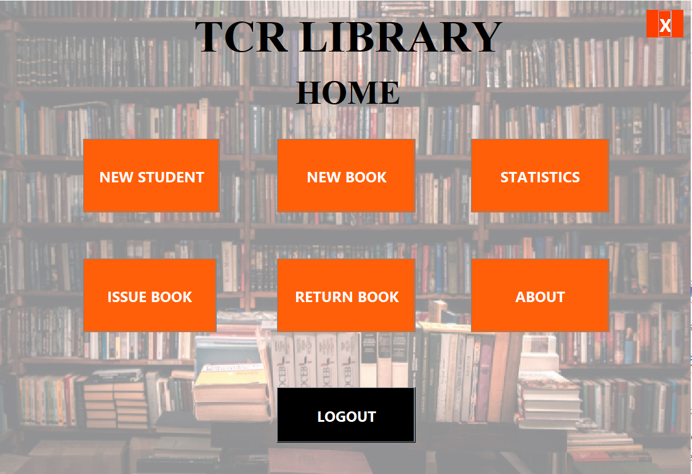

4. Adding a New Student 🧑‍🎓
The system includes a dedicated page to register new students. This ensures that only registered individuals can borrow books.

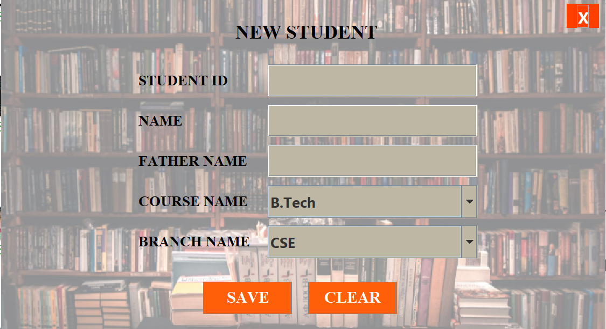

4. Managing Books 📖
This section allows for the management of the book catalog. New books can be added, and existing book details can be updated.

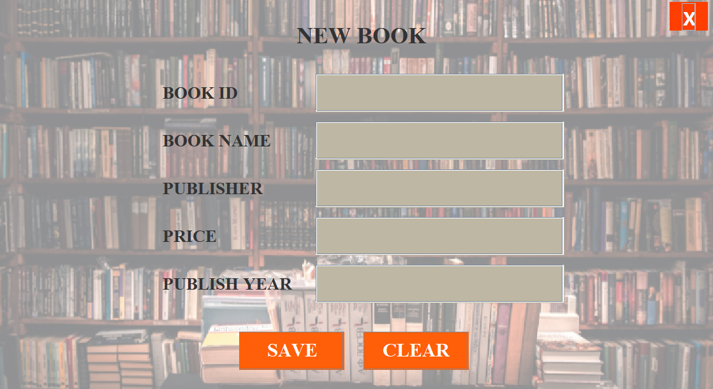

5. Issuing a Book 📤
To issue a book to a student, the user fills in details such as the student's ID, book's ID, and the issue date. The system logs this information.

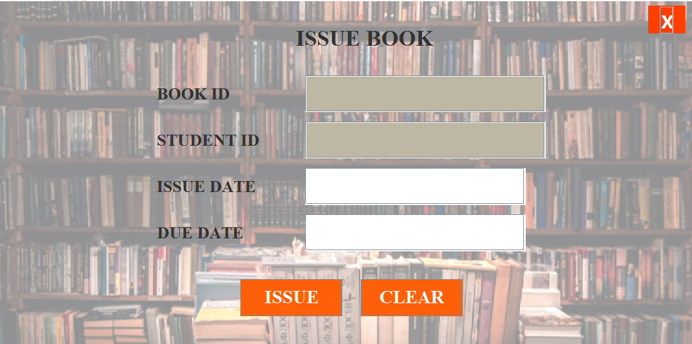

6. Handling Book Returns 📥
The return process is just as simple. The system identifies the issued book and records the return date, calculating any overdue fees if applicable.

7. About Me ℹ️
A dedicated page provides information about the developer and the project's purpose.

Used Tools:Apache Netbeans(IDE), MySQL for Database connectivity
